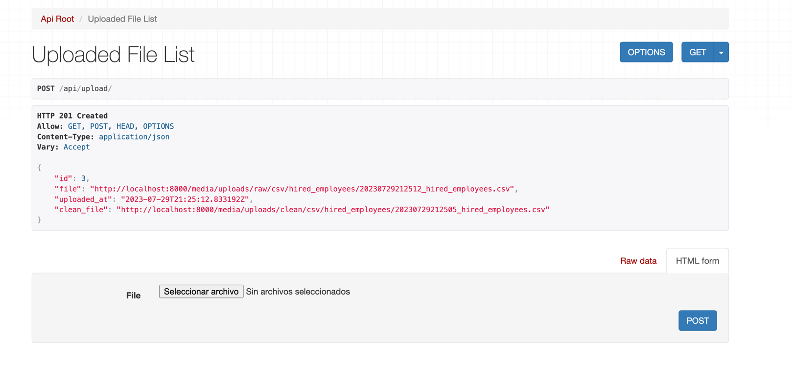
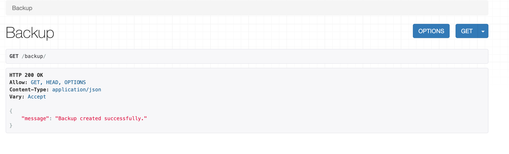

# Magneton


## Description
Magneton is a Django server that provides a REST API for the processing of Data in 3 different modules(magnemites... get it?):
- **uploader**: Uploads a file to the server and stores it in a database.
- **backup**: Creates a backup of the database in S3 bucket in Avro Files.
- **recover**: Recovers the database from a backup in S3 bucket.

NOTE: There is a 4th module called **magneton** that is the main module of the project and it is used to run the server and contains the main models.

## Installation

To install the project you need to have installed [Docker](https://docs.docker.com/get-docker/) and [Docker Compose](https://docs.docker.com/compose/install/).

Once you have installed Docker and Docker Compose you need to clone the repository and run the following command in the root of the project (make sure you are in the same directory as the `docker-compose.yml` file):

```bash
docker-compose up
```

Once the containers are up and running you can access the server in the following URL: [http://localhost:8000/](http://localhost:8000/)

## Usage
### Uploader
The uploader module is used to upload a file to the server and store it in the database. To use it you need to send a POST request to the following URL: [http://localhost:8000/api/upload](http://localhost:8000/api/upload) with the file in the body of the request.



Upload an example file and wait until the server responds with a 201 created status code.

### Backup
The Backup Module is used to create a backup of the database in S3 bucket in Avro Files. To use it you need to send a GET request to the following URL: [http://localhost:8000/backup](http://localhost:8000/backup).



Wait until the server responds with a 200 OK status code.

### Recover
The Recover Module is used to recover the database from a backup in S3 bucket. To use it you need to send a GET request to the following URL: [http://localhost:8000/recover](http://localhost:8000/recover).
This module will delete all the data in the database and replace it with the data in the backup.


